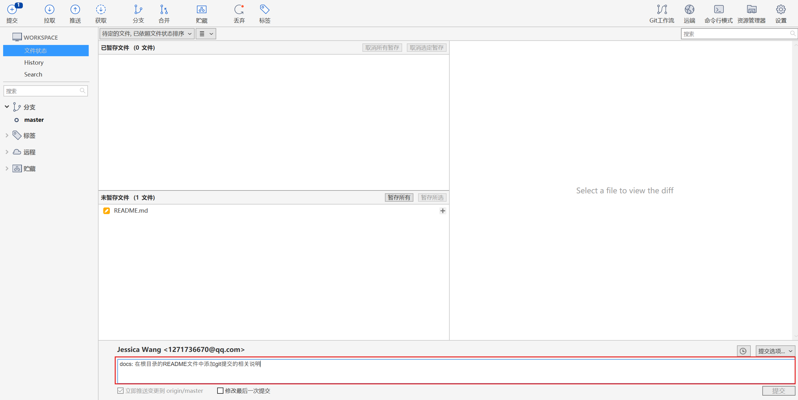

# 图书借阅管理系统

## 项目结构

项目根目录/
├── bbms-backend/ # 图书管理系统后端
├── book-frontEnd/ # 图书管理系统前端  
├── documents/ # 项目文档资料
├── proj-02/ # 参考项目：健身房管理系统项目
└── README.md # 项目总说明文档

## 相关资料

参考文档：【腾讯文档】图书借阅管理系统需求文档
https://docs.qq.com/doc/DY1pXUENSQkpWU0Vp

原型图：https://rp.mockplus.cn/rps/9rMysAhUAWo/edVOx42RU7g? 请查看《图书借阅管理系统》

分工表（前端+后端）：【腾讯文档】web 分工表
https://docs.qq.com/sheet/DY3dhUEdVaGdzWExO?tab=BB08J2

## 参与人员及分工

前端：林亦惠、万怡娟

后端：邬红琰、肖雅宁

## 环境配置+技术栈

### 前端

NodeJS 22.21.0

pnpm 10.19.0

### 后端

jdk 17.0.4

Spring Boot 3.5.7

## Git提交规范

Git 提交规范主要遵循**约定式提交**（Conventional Commits），这是目前最流行的规范标准。

### 核心规范格式

```
<类型>[可选的作用域]: <描述>

[可选的正文]

[可选的脚注]
```

### 提交类型（Type）

| 类型 | 说明 | 示例 |
|------|------|------|
| `feat` | 新功能 | `feat: 添加用户注册功能` |
| `fix` | 修复bug | `fix: 修复登录页面闪退问题` |
| `docs` | 文档更新 | `docs: 更新API接口文档` |
| `style` | 代码格式调整 | `style: 调整代码缩进格式` |
| `refactor` | 代码重构 | `refactor: 重构用户服务类` |
| `perf` | 性能优化 | `perf: 优化图片加载性能` |
| `test` | 测试相关 | `test: 添加用户登录测试用例` |
| `build` | 构建相关 | `build: 更新webpack配置` |
| `ci` | CI配置 | `ci: 添加GitHub Actions工作流` |
| `chore` | 其他修改 | `chore: 更新依赖包版本` |
| `revert` | 回滚提交 | `revert: 回滚某次错误提交` |

### 详细规范示例

#### 基础提交
```
feat: 添加图书借阅功能
```

#### 带详细描述的提交
```
fix: 修复用户列表分页错误

- 修复页码计算逻辑错误
- 调整分页组件样式
- 添加分页异常处理

Closes: #123
```

#### 破坏性变更提交
```
feat!: 重构用户认证系统

BREAKING CHANGE: 移除旧版JWT认证方式，请使用新的OAuth2认证
```

### 完整规范要求

#### 1. 标题行规则
- **类型**：使用小写英文
- **描述**：使用祈使句，现在时态
- **长度**：不超过50个字符
- **标点**：末尾不要加句号

#### 2. 正文规则
- 每行不超过72个字符
- 说明**为什么**修改，而不是**怎么**修改
- 使用列表项说明具体变更

#### 3. 脚注规则
- 引用相关Issue：`Closes: #123, #456`
- 破坏性变更：`BREAKING CHANGE: 描述`
- 关联PR：`Refs: !123`

### 实际项目示例

#### 图书管理系统提交示例
```bash
# 功能开发
git commit -m "feat(借阅管理): 添加图书续借功能"

# Bug修复
git commit -m "fix: 修复归还图书日期计算错误"

# 文档更新
git commit -m "docs: 更新API接口文档"

# 代码重构
git commit -m "refactor(用户服务): 提取用户验证逻辑到独立类"

# 测试用例
git commit -m "test: 添加图书搜索功能测试用例"
```

#### 带详细信息的提交
```bash
git commit -m "feat(搜索功能): 添加高级搜索选项

- 添加按作者搜索功能
- 添加按ISBN搜索功能
- 优化搜索性能

Closes: #45
Related: #32"
```

#### SourceTree提交信息输入框



### 分支命名规范

#### 功能分支
```
feature/功能简述
feat/user-registration
feat/book-search
```

#### 发布分支
```
release/版本号
release/v1.2.0
```
